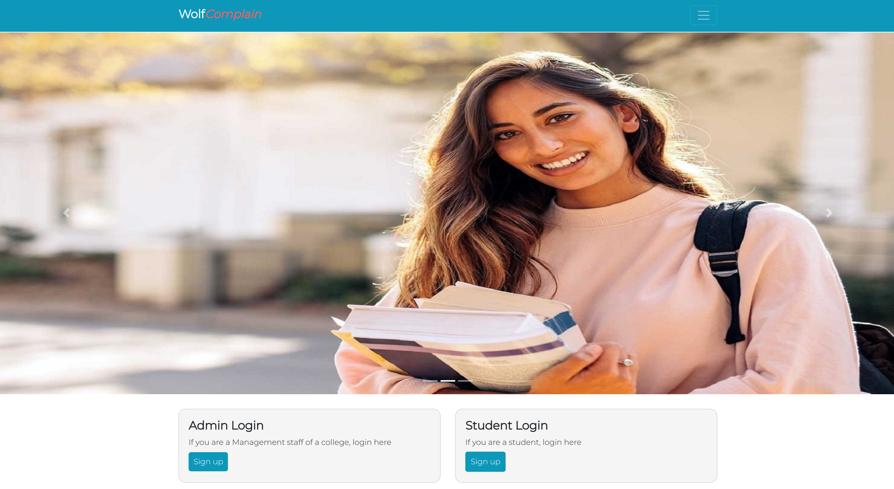
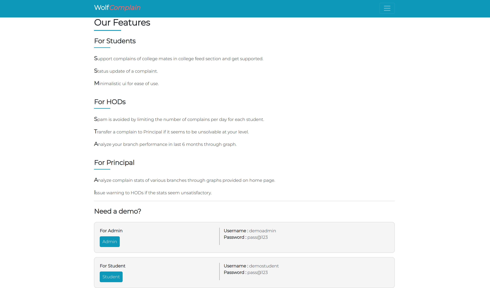
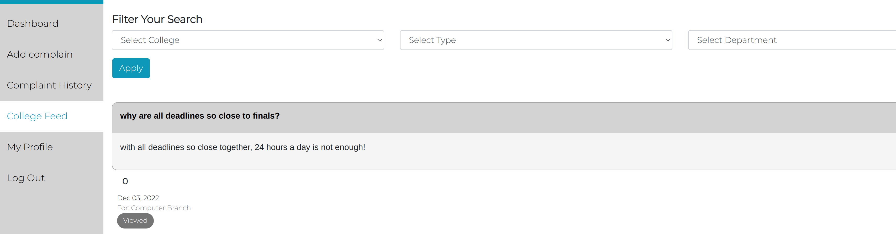
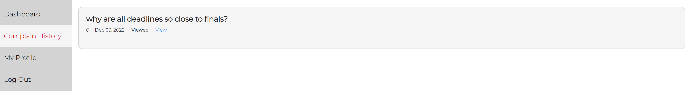
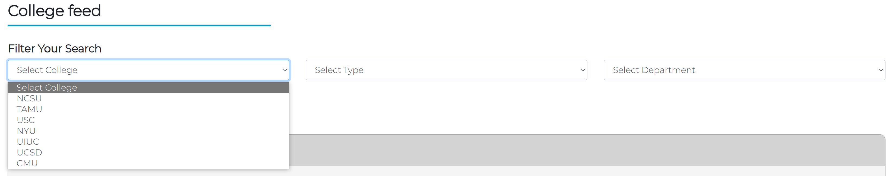
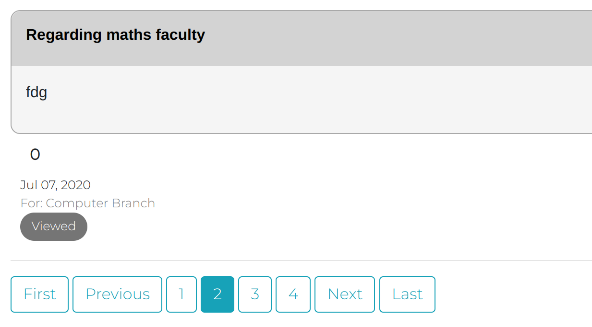

# SE_Group25_Project_2: WolfComplain 2

<!-- Head -->

<!-- SHIELDS -->

<div align="center">
<a href="https://github.com/divyagiridhar/SE_Project_2/issues">
        </a>

<a href="https://github.com/divyagiridhar/SE_Project_2/blob/main/LICENSE"> 
        </a>

<a href="https://github.com/divyagiridhar/SE-Group-25-WolfCare.git">
    </a>
    
<a href="https://github.com/divyagiridhar/SE_Project_2/graphs/contributors">
    </a>
    
<a href="https://github.com/divyagiridhar/SE-Group-25-WolfCare">
    </a>
    
<a href="https://github.com/divyagiridhar/SE-Group-25-WolfCare/tags">
    </a>
    
<a href="https://codecov.io/gh/divyagiridhar/SE_Project_2/branch/main">
    </a>
    
<a href="https://zenodo.org/record/7402637#.Y466FXbMLIU">
    </a>
    
<a href="https://github.com/divyagiridhar/SE_Project_2/actions/workflows/code_checker.yml">
    </a>
    
<a href="https://github.com/divyagiridhar/SE_Project_2/graphs/commit-activity">
    </a>
    
<a href="https://github.com/divyagiridhar/SE_Project_2/actions/workflows/django.yml">
    </a>
    

</div>

## Introduction

This repository contains source code for Project 2 which was created for CSC 510 course of NC State University Fall 22. This project is an extenstion to the project 1 developed by Team 28. Below is the introduction for the same - Here at NC State each faculty has their own set of rules they use for teaching and grading students. Students are given access to a lot of resources and Moodle website is one such. The site contains all the details related to courses a student has taken, but the Moodle page is overcluttered and there is a lot of data which is unorganised. This leads to faculty using other specialized softwares and platforms like Discord, GitHub, Piazza for tasks like doubt solving, class participation exercises, forums, etc.

This leads to students spending useful time at learning and getting acquitaned to all these different softwares. Students waste time in finding answers to questions like 'where can I find this feature' or 'how do I post this' which could be better spent on productive things. Also finding a particular resource takes more time and as such students tend to ask the same questions again and again. 

This website, WolfComplain, was thus created to tackle this issue. It is specifically designed for doubt solving and class discussions. In our website students can easily track all the questions they have asked so far across all courses. Also they can find all doubts posted for a particular course by all other students. 
We have created tags for all doubts and as such students know the status of all their doubts. With this project we aim to increase the productivity of students and faculty by avoiding time to learn new softwares and lesser chances of same doubts being posted again and again.


## Advertisement Video
https://user-images.githubusercontent.com/70748055/205815526-333953ec-82af-41a1-b9e6-fdcbc059dc06.mp4


## Installation and Execution
### Method 1:
This method requires:
```
    -Python 3.6 or greater
    -pip (or) pip3  
``` 
1. Install the entire source code from this git repository as a zip file and extract it.
2. Install the necessary packages for the project using the following command - 
``` 
pip install -r reqirements.txt
```
3. Setup the database using the following command - 
```
python manage.py makemigrations
```
4. Create the superuser using the following command - 
```
python manage.py createsuperuser
```
5. Finally start the server using the following command - 
```
python manage.py runserver
```
6. Now the application is running on your local device and you can access the website by goign on the local host port:8000 of your device. 
### Method 2: 
1. Install the Docker Desktop application on your device.
2. Download the docker image file(.tar) using this link https://drive.google.com/file/d/1_-hrrcBlHTl3_KFKhyfN6XwS6KpcxVbP/view?usp=sharing
3. Build docker image using the following command - 
```
docker build --tag <docker-image-name> .

# add the --network=host tag if you run into network problems
```
4. To execute the application, run the docker image which you just created using the following command -
```
docker run --publish 8000:8000 <docker-image-name>
```
5. Now the application is running inside the docker container and you can access the website by goign on the local host port:8000 of your device. 


## Demo Video Tutorial

https://user-images.githubusercontent.com/54198410/205815070-1cb2614b-d5de-47fe-9ba9-01afab486c28.mp4


## Output:





Student View Complaints



Admin View Complaints



## New and improved functionalities 
1. Dockerized the entire application for quicker deployment

- One of the biggest advantage of using docker is one can easily run a complex app locally, on any machine in less than five minutes. One can run the above 5 steps on any machine where Docker is installed irrespective of the OS(Linux, MacOS, Windows) and in few minutes the application is up and running. It doesn't matter if the application was built on python 3.6 while other apps are using python 2.7 or if your system is using even different versions of these languages; each container is perfectly isolated from the others and from the host system.

- After we build container images, we can run them consistently on any server environment. Automating server installation would usually require steps and domain knowledge specific to our infrastructure. For instance, if we are using AWS EC2, we may use AMI, but these images are built differently from the ones used on Azure, Google Cloud. Configuration management systems help us by describing our servers and their configuration as manifests but writing these manifests is no easy task, and they don’t guarantee reproducible execution. These manifests have to be adapted when switching from a cloud provider to another, because they would use different network interface or disk naming. Once we have installed the Docker Engine (the most popular option), it can run any container image and effectively abstract these environment discrepancies. The ability to stage up new environments easily and reliably gives us exactly what we need to set up continuous integration and continuous deployment. 

2. Pagination to limit data load for each query
- Pagination typically means smaller, shorter responses and as a result reduced load times. Long pages take longer to load, and infinite pages require loading to take place as the user scrolls but this is not always a seamless experience. Also pagination, and shorter pages in general, can help in terms of overall navigation. The footer becomes more visible (or is allowed to exist full stop) and there is no need for floating navigation - which can come with user experience challenges of its own.


3. Filters for viewing the college feed
- Added filters on the college feed page for better user experince and for easily searching a particular feed. Currently the application has three major filters which are on the fields - college with which the feed is associated, type of the feed and the department.  





## Languages
- HTML
- Python 
- Javascript (embedded in HTML)


## Documentation
All the documentation related to our project could be found under the docs folder and at this link - https://github.com/divyagiridhar/SE_Project_2/tree/main/docs

<a href="https://github.com/divyagiridhar/SE_Project_2/blob/main/docs/Function%20Description.md">Description of Functions</a>

<a href="https://github.com/divyagiridhar/SE_Project_2/blob/main/docs/Mini_Tutorials.pdf">Mini Tutorials</a>

<a href="https://github.com/divyagiridhar/SE_Project_2/blob/main/docs/motivation.md">Motivation</a>


#### GitHub Page Link - https://divyagiridhar.github.io/SE_Project_2/


## Deployment 
This project was deployed on Heroku platform by the previous team on a free tier account but as per the new policies of Heroku they have ceased all free tier account and have started paid subscription plans for all users. As such we have created a docker image of our application which can be easily deployed on any cloud platform using Docker Engine. The link to the docker file is - https://drive.google.com/file/d/1_-hrrcBlHTl3_KFKhyfN6XwS6KpcxVbP/view?usp=sharing


## License
[MIT](https://github.com/divyagiridhar/SE_Project_2/blob/main/LICENSE.MD)


## Contributors:
1. Dhruv Patel  
2. Ravi Ghevariya
3. Manan Patel
4. Divya Giridhar
5. Shreyas Titus

